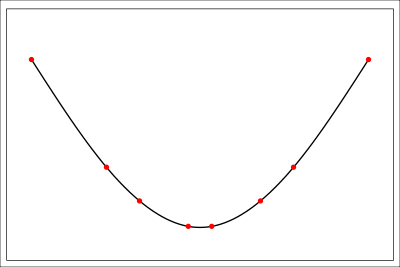

[Back to Navigation](index.html)

```{r setup, include = F}
library(tint)
knitr::opts_chunk$set(message = F, warning = F)
knitr::opts_chunk$set(comment = '#>')
knitr::opts_chunk$set(tidy = T)
```

# Forecasting Air Pollution: Preprocessing

`r newthought('Before we begin')` any data science project, it is important to discuss the motivation and setting for it. This is especially important for time series data, as a realistic forecast horizon (how far we wish to forecast into the future). 

```{r, fig.fullwidth =  T, echo = F}

```

In China, [millions](https://www.cnbc.com/2017/02/14/around-22-million-deaths-in-india-and-china-from-air-pollution-study.html) die due to air pollution each year. We would like to see if we can use data science to help them out. By forecasting when pollution will be at its worst, we can help policymakers and communities implement smart, short-term energy policies to combat it, as well as distribute masks, and prepare for the worst, in order to minimize the damage.

> What forecast horizon will be most useful?

This is a tricky part. Forecast too short (single digit hours), and there will be no time to prepare. Forecast too far ahead, and we risk making a bad forecast. In order to better decide, it is important to do a quick search on relevant literature, websites, etc. [The world air quality sit](http://aqicn.org/forecast/world/) forecasts 8 days ahead. [The EPA](https://www3.epa.gov/airnow/aq_forecasting_guidance-1016.pdf) suggests that for local forecasts (cities and regions of cities) we forecast a few days ahead, and that we also know when it starts to ramp up. Therefore, we will need to develop a model that accurately forecasts every hour for 3 days, or 72 hours.

# Getting Data

For now, before we deploy our model with a data collection script, we will use the data referenced in [this paper](https://agupubs.onlinelibrary.wiley.com/doi/full/10.1002/2016JD024877). If you are following this blog, you can get the data at:

```sh
git clone https://github.com/josephsdavid/ChinsePM.git
```

In the data directory.

`r newthought('The next step')` before doing anything is to define the data. We have Data collected in 5 cities: Beijing, Chengdu, Guangzhou, Shanghai, and Shenyang. Each of these datasets contains: air quality measurements from multiple locations within each city, humidity, air pressure, temperature, precipitation, wind direction, and wind speed, as well as info on date. For now, we will just look at the data from Beijing, measured at the US Embassy. Then, we will expand that to the other locations within Beijing, and all the other locations in the other cities. First we must build a good single model. However, keeping in mind that we will be interested in all the data when we preprocess it will save us time in the future. We must write code that can be scaled to a much larger degree.

# Batch Importing CSVs

As our data is in the format of multiple CSVs, we must first write a function to batch imort CSVs. In this case, we want to grab all the files in the `data` directory. We will need an understanding of `lapply`, as well as basic regex, in order to import our files into a list. We will also need a file import function (any will do). In my case, I will use `data.table::fread`, in order to quickly read in the files. You can also use `vroom::vroom`, but i frequently have issues with the lazy evaluation it provides, and find it leads to unexpected slow points in my code. 

```{r}
library(data.table) # fast tabular data structures
library(pipeR) # fast %>>% dumb %>>% pipes
library(magrittr) # slow %>% smart %>% pipes
import <- function(path) {
  # first we list the files in the directory
  files  <- list.files(path)
  # next we search for csvs using grepl
  files <- files[grepl(files, pattern = ".csv")]
  # next we append the path to the list of files:
  # we use vapply because we want vector output, and its 
  # incredibly fast (the fastest of the apply family)
  filepaths <- vapply(files, function(x) paste0(path, x), character(1))
  # import the files as a list
  imports <- lapply(filepaths, fread)
  # next we set up the names of each import to the list
  filenames <- gsub(".csv", "", files)
  #and any numbers
  filenames <- gsub("[[:digit:]]+", "", filenames)
  names(imports) <- filenames
  return(imports)
}
```

## Checking for Missing Data

`r newthought('The next important step')` is to check for missing data, so we know wether or not we have to import it. We can do this quickly with `rapply`, which recursively applies a function to the deepest itemset of each item in a nested list:

```{r}
naPerc <- function(xs) { 
  rapply(xs, function(x) 100 * sum(is.na(x) / length(x)), how = "list")
}

import("data/") %>>% naPerc %>% .[[1]] %>>% data.frame %>% .[-(1:6)]
```

By applying this, we see that in the data collected by the US embassy in Beijing there are about 4% NA values, and in the weather data a few too. The other data collection sites have far worse data quality. All in all, we have to deal with them.

# Imputing NAs in Time Series Data

As this is time series data, we will have to deal with missing values a little differently. If this were normal data, and we had 50,000 rows and 4-5% of the data we care about contains missing values, we would be just fine just getting rid of them. However, in a time series, we care about the order of events, and in general they must be **evenly** sampled, in order to preserve the frequency of the dataset (there are a few ways to get around this, for example in astronomical time series they frequently use [Least-Squares Spectral Analysis or the Lomb-Scargle periodigram](https://en.wikipedia.org/wiki/Least-squares_spectral_analysis)). However, this adds a degree of complexity and inaccuracy to our data which we would like to avoid if possible. To do this, we can use some interpolation.


## Spline Interpolation

There are many types of interpolation, other useful techniques include the Kalman filter and linear interpolation. However, spline interpolation is very very fast, has good accuracy (good enough to handle 4% of 50,000 points). 


```{r, echo = F, fig.cap = "Spline Interpolation Between 8 points", fig.align = "center"}

```

> What is Spline Interpolation?

In a very hand wavy sense (complex math is involved), spline interpolation is an algorithm that draws the the straghtest line possible (technically, the least bendy line), given the frequency of the dataset, and the other points. It will draw a more natural, and curvier line than linear interpolation, and is often used in time series data


Before we can interpolate the NAs in our data, we must first change the data type

## Converting data types in lists of lists

Currently, we have a list of data frames, which in its most primitive form can be described as a list of lists. We need to find a way to transform the proper columns of each nested list into a time series object.

### Dealing with recursive lists: Pattern 1

When dealing with a recursive data structure, such as a list of lists or a list of data frames, we have a few very convenient patterns. The first one we already saw, `rapply`, which recursively applies a function to the deepest layer of our object. However, this does not preserve the structure of the data, unless we use the `how = 'replace'` argument, which is incredibly slow. So, we have a three step method to deal with this:

1. Write a function that works on an individual vector

2. Write a function that applies that function to a nested data frame or list

3. Write a function that applies the previous function over the entire list

In our case, we will first write a function that converts a vector to a time series:

```{r}
toTs <- function(v) {
    ts(v, frequency = 365 * 24)
}
```

Then, we will write a function that works over the whole nested data frame. In our case, we also need to not convert some of our columns into time series format, such as the categorical variables and variables describing the date

```{r}

noConvert <- c("No", 
             "year", 
             "month", 
             "day", 
             "hour", 
             "season", 
             "cbwd")
dfToTs <- function(df, ignore = noConvert){
  dfNames <- colnames(df)
  result <- (df)
  for (name in dfNames) {
    if (name %in% ignore) {
      result[[name]] <- result[[name]]
    } else {
      result[[name]] <- toTs(result[[name]])
    }
  }
  # return the created list
  return(result)  # its a list dont be tricked
}

```

Then we scale it up

```{r}
allToTs <- function(xs){
  lapply(xs, dfToTs)
}

# To check 
# import("data/") %>>% allToTs %>>% str
```

Now that we have the proper data types, we can interpolate our NA's

## Interpolating NAs Over a Data Structure using the Try-Type Pattern

Instead of dealing with a function that uses column names, we can use the basic error checking pattern in R to quickly impute only time series data. The pattern is (in pseudo code) as follows: `x <- try(expression); if(is.myClass(x) do something, else do something else)`. As an example:

```{r}
x  <- try(sum(c("cat","dog", "mouse")))
x
class(x)

y <- try(sum(1:4))
y
class(y)
```

We see that the class of the object changes depending on whether or not our code fails. For our problem, that would be (in the case of a vector)

```{r}
library(imputeTS)
tryImpute <- function(vec){
  result <- try(na.interpolation(vec, "spline"))
  ifelse(
         is.ts(result),
         return(result),
         return(vec)
  )
}
```

If our imputation works, we return the result of it, otherwise we return the original vector. Our next step is to run it over an entire data frame, preferably in parallel, so it can be fast:

```{r}
library(parallel)
cores <- detectCores() - 1
#> [1] 11

imputeDf <- function(df){
  result <- mclapply(df, tryImpute, mc.cores = 11)
  return(as.data.frame(result))
}

import("data/") %>% allToTs %>% .[[1]] %>% imputeDf %>% head
```

It works. Now lets follow our pattern and run that over the entire list:

```{r}
imputeAll <- function(xs){
  lapply(xs, imputeDf)
}

#> str(imputeAll(allToTs(import("data/"))))
```

# Converting to a Convenient Data Structure

As we will be passing this information into a lot of other documents and scripts, and growing and manipulating it frequently, we would like to put it into a convenient data structure, that is scalable, extensible, and fast. That structure is an associative array, or a hash table, the swiss army knife data structure of data science. We will use it to store *all* models created, variations of our dataset, and anything else, and pass this between files. For analysis on the speed and power of the hash table, please refer to [this link](https://blog.dominodatalab.com/a-quick-benchmark-of-hashtable-implementations-in-r/).

```{r}
toHash <- function(xs){
  list2env(x = xs, hash = TRUE, envir = NULL)
}
```

# Chaining it All Together

We have done a lot of work, and put together a nice little pipeline. Now, if we are going to be calling these functions a lot, it is not super convenient or efficient to chain them together with `%>%` or `%>>%` pipes. Instead, we will make a ***composition of functions***. If we have three functions, $f(x)$, $g(x)$, and $h(x)$, a composition of the three would be $f(g(h(x)))$. We will do the same using the `functional` library:

```{r}
library(functional)
preprocess <- Compose(import, allToTs, imputeAll, toHash)
preprocess
```

We now have a function that imports a directory of csv's, converts the proper items to time series objects, spline interpolates the NAs, and converts to a hash table:

```{r}
china <- preprocess("data/")
str(china)
head(china$BeijingPM_, 100)
```

Finally, lets save our work for next time:

```{r}
saveRDS(china, file = "store/china.Rds")
```


# Navigation

[launchpad](index.html#my-blog)
